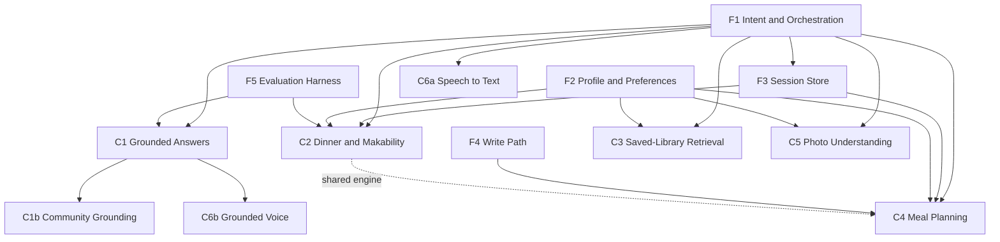

# MyRecipes Assistant — Backend Capability Map

**Status:** Working draft for team review
**Author:** Andrew Alburn
**Last updated:** August 21, 2026
**Audience:** Food Search & Discovery engineering
**Purpose:** Give us a shared map of everything the assistant needs on the backend, so we can break it down and sequence it together

**Exploratory inputs:** `poc/PRD - Agentic Recipe Assistant.md` · `PRD - Assistant Semantic Query Planner.md` · `poc/PRD - Dinner Decision Engine.md` · `Dinner Tonight - Data Science Problem Statement.md` · `poc/PRD - User Recommendation Preferences.md` · `poc/PRD - Photo-Based Recipe Discovery.md` · `../../recipe-intelligence/overview.md`

---

## 1. Why this document exists

We have a working prototype and a set of exploratory documents created to get it built quickly. This document takes the next step: mapping the backend capabilities required to make the assistant real, what each piece depends on, and what remains unresolved. It is a discussion guide, not yet a technical spec or delivery plan.

Two framing choices matter:

- **The prototype and its supporting PRDs are inputs, not validated requirements.** They give us concrete behavioral examples and useful starting hypotheses, but they were created quickly to guide the POC. They should not prescribe the production experience, service boundaries, or architecture.
- **Shared foundations come before features.** Five backend capabilities underpin the full feature set. Naming them separately should help us avoid duplicating them or discovering them mid-build.

### What we need from the session

1. Agreement on whether this list is complete, and what I've missed.
2. Corrections to the strawman sizing.
3. Clear positions on the five questions in §12.
4. A first sequencing pass.

The proposed sequence covers roughly the next two to three quarters. It prioritizes work that unlocks the most downstream capability, then uses risk reduction as the tiebreaker. The phases are intentionally undated until the team validates the work.

### Scope

We are building the search, retrieval intelligence, and meal-planning capabilities ourselves. We may reuse foundational MCP or platform infrastructure elsewhere in the company, but that is still undecided. This document therefore defines the capabilities we need without prescribing where they must be hosted.

---

## 2. What we're building toward

One sentence: **a server-side assistant that understands what a user is asking, answers it from our own content and our own knowledge of that user before it reaches for a general model, and returns usable product output rather than paragraphs.**

Unpacked slightly, that means production needs to be able to:

- Interpret a natural-language request in the context of what the user is looking at, and route it to the right capability.
- Answer questions about a recipe from our own corpus — Serious Eats technique content, editorial how-tos, and eventually community reviews — with a real citation, and say honestly when we can't.
- Do that fast enough to work in a hands-free voice conversation, not just in text.
- Recommend dinner in a way that accounts for both what someone likes and what they can realistically make tonight.
- Retrieve intelligently within a user's own saved recipes.
- Generate and refine sets of recipes — a week of meals, a themed collection — and persist them.
- Take a photo as input and figure out whether it's a fridge or a plate, then act accordingly.
- Take voice as an input method for ordinary queries.

And underneath all of it: know who the user is, remember the conversation, write things down durably, and let us verify that it's behaving correctly.

---

## 3. How to read each entry

Each capability below has the same shape:

- **What it is** — plain description of the capability
- **Where we are today** — what exists in the POC or production, with the distinction made explicit
- **What we'd need to build** — the actual work, decomposed enough to argue about
- **Depends on** — what has to exist first
- **Ownership & dependencies** — who is likely to be involved; deliberately not a decision
- **Open questions** — the things I genuinely don't know the answer to
- **Rough size** — S / M / L / XL, as a strawman for you to correct

A note on sizing: I've sized these as "capability delivered to a production standard," not "spike that proves it works." Where the gap between those two is unusually large, I've said so.

**One assumption I'm making throughout:** production already has accounts, saved recipes, and collections. Everything else in the foundations section is new. If that's wrong, several sizings below move.

References to the POC and its PRDs show where an idea came from; they do not mean the idea has been validated. This document should stand on its own, and the team should reopen any consequential product or architecture decision during planning.

---

# Part 1 — Foundations

These five underpin everything in Part 2. None of them is a feature a user would name, and all of them are load-bearing.

## F1 — Intent & Orchestration Service

**What it is.** The thing that takes a request and decides what to do with it. Someone types "what are my quickest chicken recipes" and something has to determine: is this a search of the whole catalog or just their saves? Is this a question or an instruction? Which capability handles it, and what does it need passed to it?

The POC explored a structured intent object, a routing priority (explicit action beats explicit source beats surface default), a split between hard requirements and soft strategies, and a hybrid of cached plans plus LLM fallback. These are useful starting hypotheses, but the production contract, routing policy, and service boundary still need validation.

**Where we are today.** The POC implements this in client-side TypeScript (`src/assistant/orchestrator.ts`, `types.ts`, `session.ts`) with tools behind a common interface. That demonstrates the pattern, but not whether the same contract or boundary is right for production.

**What we'd need to build.**

- A versioned intent contract — the structured object every capability receives. This is the most important artifact in this whole document, because everything else conforms to it.
- A tool registry and the adapters that map an intent to a capability call.
- A decision on whether common intents should use a versioned plan library, with LLM planning as fallback. The POC documents nine candidate starting intents.
- LLM-backed planning for anything the cache doesn't cover, with structured output and a caching policy for what it produces.
- Surface-context handling, so "on a recipe page" and "in my saves" mean something to the router.
- An inspectability path showing parsed intent, rejected candidates, and routing decisions. Regardless of the final design, we will need this to debug the system.

**Depends on.** Nothing. This is the root of the tree, which is most of why I've put it first.

**Ownership & dependencies.** Ours to build. The open question is whether it runs as a standalone service we operate or sits on shared platform infrastructure — worth deciding deliberately rather than by default.

**Open questions.**

1. Does all assistant traffic flow through the orchestrator, or can clients call some capabilities directly? I'd argue everything goes through it, for consistency and instrumentation, but that has a latency cost on simple requests.
2. Where do the model calls live, and what's our posture on model choice and versioning?
3. What's the latency budget for a cached-plan route versus an LLM-planned route? These are very different numbers and the UI needs to know which it's getting.
4. How do we version and invalidate cached plans without shipping an app release?

**Rough size.** L. The POC gives us a head start on the problem space, but the production contract and service design remain open.

---

## F2 — User Profile & Preference Service

**What it is.** One place that answers "who is this user, and what do they like." Three kinds of signal live here:

- **Explicit** — what the user has told us directly: dietary restrictions, disliked ingredients, favorite cuisines and flavors, cooking-style preferences, and pantry staples.
- **Inferred** — what we predict about the user's tastes, including the representation Data Science builds from save behavior.
- **Behavioral** — what the user has done: saves, views, ratings, dismissals, and cooks.

**Where we are today.** This is the messiest area in the whole map, and worth being blunt about.

Production has accounts and saved recipes. Data Science has a real inferred taste capability built from saves. The POC uses one hardcoded profile (`PERSONA`); a related exploration adds locally stored, user-editable preferences. Neither is a validated production model.

Two problems worth naming:

**Two complementary preference sources.** The Data Science **Flavor Profile** infers taste from saves. **User Recommendation Preferences** captures what the user explicitly tells us, such as diet, dislikes, cooking style, and pantry staples. We should keep these names and roles distinct.

**We cannot tell whether someone cooked a recipe.** There is no reliable cook signal today. That makes two high-value library queries — "most cooked" and "saved but never made" — impossible, and it blocks the outcome measure that matters most for dinner recommendations: did they make it?

**What we'd need to build.**

- Server-side storage and a write API for explicit preferences, so they persist and follow the user across devices.
- A composed read API that returns explicit, inferred, and behavioral signals together, so no consumer has to assemble it themselves.
- A hard-constraint contract that's unambiguous about severity. An allergy-tier restriction is absolute, including when metadata is uncertain — conservative exclusion, every time. This needs to be enforced in one place rather than reimplemented per capability.
- Cook-signal capture. Even something as simple as an "I made this" action gets us started.
- A normalized available-ingredients input, however it was collected — stated staples, a photo, voice, or typed input.

**Depends on.** Whatever owns accounts and saves today.

**Ownership & dependencies.** Shared. Explicit preferences and the composed read API are ours. The inferred taste representation is Data Science's. Cook-signal capture touches client, backend, and analytics.

**Open questions.**

1. Should the profile service return one standardized recommendation context containing explicit preferences, inferred taste, and behavioral signals, or should each consuming feature assemble those inputs itself? I recommend one shared context so every feature receives the same inputs, with hard constraints enforced separately as mandatory gates.
2. Where do explicit preferences live — extend the existing user service, or stand up something new?
3. What's the minimum viable cook signal, and what's the lightest-weight way to capture it? This is small work with outsized leverage.
4. How do we handle the cold start? A brand-new user has no saves, no inferred taste, and no explicit preferences. An empty profile is more honest than an invented one, but the assistant still has to be useful on day one.
5. Do we ever promote a repeated session constraint into a stored preference — "you've said no mushrooms three times, want me to remember that?" Good feature, real consent question.

**Rough size.** L, and it's the one I'd most expect to be underestimated because it spans several existing systems.

---

## F3 — Session & Context Store

**What it is.** Conversation memory. Someone says "no mushrooms," then two turns later says "make it faster," and the system still knows about the mushrooms. It holds active constraints, prior turns, the current result set, and the ledger of recipes we've already shown so we don't repeat ourselves.

**Where we are today.** The POC holds this in browser state. It demonstrates continuity within a session and across surfaces, but does not survive a refresh, a tab close, or moving to another device.

**What we'd need to build.**

- A session object with a defined lifetime, readable and writable by the orchestrator.
- Constraint merge semantics. This is subtler than it looks: when someone says "make it faster" on top of "no pork," we keep both. When they say "actually, pork is fine," we remove one. When they say something ambiguous, we need a defined rule rather than emergent behavior.
- An exclusion ledger for repeat protection, including a decision on how far back it should look.
- Surface transition handling, so context carries when someone moves from the homepage into their saves mid-conversation.
- A decision on whether the first production version is session-only and how easily the store can support cross-session memory later.

**Depends on.** F1, since the orchestrator is the primary reader and writer.

**Ownership & dependencies.** Ours.

**Open questions.**

1. Server-side, or client-side with server sync? Server-side is more robust and lets us instrument it; client-side is faster and cheaper.
2. When does a session end? A timeout, an explicit close, or a session that just persists until the next one starts?
3. What's the retention and privacy posture? Conversation history is more sensitive than search history and should be treated that way.
4. Do we store the result sets themselves or just their identifiers? Affects "more like the second one," which needs to know what the second one was.

**Rough size.** M.

---

## F4 — Write Path

**What it is.** The assistant's ability to durably change something — save a recipe, create or modify a collection, save and edit a meal plan.

**Where we are today.** Production has saves and collections. The POC has an in-memory plan store that disappears on refresh. One proposed production model is to represent a meal plan as a typed collection with an optional week label; that needs to be validated against the existing collections model.

**What we'd need to build.**

- Extend the collections model with the plan discriminator and the optional week label.
- Assistant-facing write endpoints with explicit-confirmation semantics. The current product direction is that the assistant never writes implicitly; if we keep that principle, the guarantee should live in the contract rather than depend on UI discipline.
- Idempotency, so a retried request doesn't create two plans.
- **Attribution.** Saves per session is our primary KPI, and assistant-attributed saves are a likely leading indicator. If we want that measure, attribution needs to be built into the write path from the start rather than retrofitted later.

**Depends on.** Whatever owns saves and collections today.

**Ownership & dependencies.** Shared between us and the owner of the existing collections service.

**Open questions.**

1. Does the current collections model support a typed discriminator, or does adding one mean a migration?
2. How do we represent attribution — a source field on the save, a separate event, or both?
3. Do plans need day and slot assignment in the first version? If not, do we design the schema to accommodate it now or accept a later migration?
4. Should a smart collection be a snapshot or a live query that re-evaluates? This is really a product question with a schema consequence — see §7.

**Rough size.** M, assuming collections is extensible. L if it isn't.

---

## F5 — Evaluation & Observability Harness

**What it is.** The ability to answer "is it behaving correctly" repeatedly and automatically, rather than by clicking around and forming an impression.

**Where we are today.** Nothing exists. The exploratory documents contain candidate regression cases, evaluation queries, and cross-surface routing pairs. They are useful seeds for a real test set, not yet validated acceptance criteria.

**Why this is a foundation rather than a follow-up.** The product direction depends on strict constraint handling, especially for allergies and explicit exclusions. We cannot credibly make those guarantees without verifying them on every change. The capabilities in Part 2 are also mostly LLM-mediated, which means they can regress without throwing exceptions.

**What we'd need to build.**

- Golden query sets per capability, using the exploratory examples as initial candidates.
- Automated checks for constraint violations, course eligibility, deduplication and diversity, groundedness and citation accuracy, and latency percentiles.
- A shared trace view showing parsed intent, candidates rejected by hard gates, scores by dimension, and evidence used.
- Online metric wiring tied to the measures we validate for each capability.

**Depends on.** Nothing structurally, though it needs capabilities to test. Worth starting alongside the first capability rather than after it.

**Ownership & dependencies.** Ours, with Data Science likely having a strong point of view on offline evaluation methodology.

**Open questions.**

1. Build, or adopt an existing evaluation framework? I lean adopt, given how much of this is a solved problem.
2. Who owns groundedness scoring — is it automated, human-reviewed, or a sample of both?
3. Does this run in CI on every change, nightly, or on demand? CI is the honest answer and the most expensive one.
4. What's the acceptance bar? The Recipe Intelligence exploration proposed 70% retrieval spot-check success, 85% routing accuracy, and 80% grounded-answer accuracy. Those are starting points to validate, not commitments.

**Rough size.** M to start, and it grows with every capability. Think of it as a permanent line item rather than a project.

---

# Part 2 — Feature Capabilities

## 4. C1 — Grounded Answer Service

**This is the biggest capability in the document and the clearest expression of our strategy.** Everything else makes the assistant more useful. This one makes it *ours* — grounded in content nobody else has, rather than a thin wrapper over a general model.

There's a second reason it matters beyond food. If we can prove that chat-style questions can be answered reliably from the licensed corpus with real citations, that pattern isn't recipe-specific. The synthesis, confidence routing, caching, and evaluation approach are brand-agnostic; the food-specific parts are query formulation, relevance filtering, and recipe-context injection. Every vertical would need its own version of those, so this doesn't transfer for free — but the architecture and the operational knowledge do, and no one in the portfolio has proven it yet.

**What it is.** Someone asks a cooking question — on a recipe page, in the assistant, or out loud while cooking. We answer it from People Inc content with a real citation, and we say honestly when we can't. Only after we've genuinely tried our own corpus do we fall back to a general model, clearly labeled.

**Where we are today.** The POC sends the question and recipe context to OpenAI and labels the answer as AI-generated. It demonstrates the interaction but uses none of our content. A separate Recipe Intelligence exploration proposes grounded retrieval over Serious Eats how-tos, confidence routing, and an honest miss rather than fabrication. That approach is unbuilt and unvalidated, but the People Inc Content API gives us a real path to test it.

### What the Content API actually gives us

I read the v1 integration guide, and it's worth being precise here because several of my earlier assumptions were wrong. Two endpoints:

- `POST /v1/search` — a natural-language question in, up to five ranked licensed articles out. Critically, **each result includes the full article markdown inline.** No second fetch needed.
- `GET /v1/markdown?url=` — a specific article by canonical URL, with ETag conditional caching.

Auth is a single API key header. Rate limit is 100 requests per second per route, which is generous. Markdown retrieval is billed per successful response, with 304s free — so ETag caching has direct cost value.

**The good news:** search returns full body text, so grounding is a single round trip. That materially improves the latency story, especially for voice.

**Four constraints that shape the design, and that I'd want us to look at closely:**

1. **There is no relevance score.** Results come back with a `rank` and nothing else. The docs say to use every result. That means we cannot threshold on the API's confidence, because it doesn't give us one — **judging whether an answer actually exists in these five articles is entirely our job.** This is the single most important engineering consequence in this document.

2. **We can't scope the search to food.** There's no domain or brand filter in the request. The corpus is all of People Inc — the docs' own example returns an Investopedia article. A cooking question will be searched against everything, and we'll need our own filtering on the way back. Worth reading this twice, though: from a food perspective it's overhead, but it also tells us the corpus was built cross-brand from the start, which is what makes the portfolio argument above real rather than aspirational.

3. **Five results, hard cap, no pagination.** We get five shots per query. Which means query formulation quality matters enormously, and multi-query strategies become attractive.

4. **Payload size is the cost and latency driver.** Five articles at 1,200–1,800 words each is roughly 8,000 words of context per question. That's the number to design around.

Also worth noting: the API is editorial articles only. No UGC, no structured recipe data. Community content is a separate build.

**What we'd need to build.**

- **Query formulation.** The gap between "user asks a question about the recipe in front of them" and "query that returns the right five articles" is the real work. A user asking "can I use Greek yogurt instead of sour cream" on a specific recipe needs that question expanded with recipe context into something the search will answer well.
- **Relevance filtering.** Given no score and no domain filter, we need our own pass: is this article food content, and is it actually about the question? The `sourcetype` field also lets us prefer human-written content over AI-generated, which seems worth doing for a trust-led product.
- **Answer synthesis.** Read the surviving articles, decide whether an answer genuinely exists, extract it with a quote and citation, or return an honest miss.
- **Confidence routing.** Define when to return a grounded answer, an honest miss, or a labeled general-model fallback. One useful evaluation approach would be to turn fallback off initially so we can measure retrieval quality in isolation.
- **Caching.** Cooking questions repeat enormously across users. "Can I substitute buttermilk" is the same question regardless of who asks. Caching by normalized question rather than by user should give us a very high hit rate, and it's the main lever on both cost and latency.
- **Recipe context injection.** The same question means different things on different recipes.

**Depends on.** F1 for routing. F5 to know whether it's any good — this is the capability where I'd least want to ship on vibes.

**Ownership & dependencies.** The Content API team owns the API and the corpus. Query formulation, filtering, synthesis, routing, and caching are ours.

**Open questions.**

1. What's the actual latency of a search call? This gates the voice use case entirely and we should measure it in week one.
2. How is search billed? The docs defer to the licensing agreement. We need the model before we can design caching sensibly.
3. Is Serious Eats technique content well-represented in the licensed corpus, and does it rank well for cooking questions? A corpus audit should be the first step.
4. Can we get a domain filter, or a relevance score, or more than five results? Worth asking rather than assuming not.
5. Full articles or chunks? We get full articles. Do we chunk locally before synthesis, or pass them whole?
6. What's our honest-miss rate going to be, and what's acceptable? A grounded answer service that misses most of the time is worse than a labeled model answer.

**Rough size.** XL for the full capability. A meaningful spike — one question type, one content vertical, real measurement — is more like M, and I think that spike should happen early regardless of how we sequence the rest.

### C1b — Community content grounding

**What it is.** The same pattern against reviews and comments. "Is this recipe actually as easy as it says" is a question only our community can answer, and it's a genuinely differentiated one.

**Where we are today.** No ingestion pipeline exists. Earlier exploration identified a likely minimum dataset — comment text, recipe ID, date, anonymized user, and rating — but that still needs validation. The Content API does not cover UGC.

**Why it's separated out.** It's the same retrieval and synthesis pattern, so most of C1's work is reusable. But it depends on a corpus that doesn't exist yet, which makes it a different sequencing conversation. Building C1 well makes this substantially cheaper later.

**Open questions.** Where does review data live and how do we get at it? What's the permissions and attribution posture on surfacing user content in a synthesized answer? Do we need a separate index or can this share infrastructure?

**Rough size.** L, mostly gated on the corpus rather than on our work.

---

## 5. C2 — Dinner Recommendation & Makability

**What it is.** "What's for dinner tonight" — three dinner-appropriate recipes that respect every hard constraint, that the user will plausibly like, and that they can realistically make tonight.

The second half is the hard part. A taste-only recommender can produce appealing recipes that still require a grocery run. Makability — confidence that someone could realistically make a recipe tonight — is a different problem from predicted taste.

**Where we are today.** The POC combines live search with rules-based ranking against a mocked profile. It demonstrates the intended experience, not recommendation quality. Data Science is evaluating how inferred taste and available ingredients could support a production approach.

**What we'd need to build.**

- Makability scoring. This needs ingredient-level understanding of recipes, and it needs to weigh ingredient importance rather than count overlap — missing the protein is not the same as missing parsley.
- A dinner-eligibility gate. Every returned item must be a dinner main. No breakfast, dessert, sides, or roundups. This depends on course metadata, and our coverage there is incomplete.
- A candidate-source strategy across the user's saves and the broader catalog.
- Structured evidence per recommendation, so the assistant can explain the choice credibly without us hand-writing copy.
- Diversity, so three recommendations aren't three versions of the same dish.

**A dependency worth naming.** Makability is only as good as our ingredient normalization. "2 boneless skinless chicken breasts" and "chicken" have to be the same thing. That ties this capability to the ingredient ontology work, and it's the kind of dependency that's easy to discover late.

**A second one.** The dinner-eligibility gate needs course metadata we don't fully have. Our coverage gap there is real and I've raised it upward already. Worth deciding whether we gate on metadata, infer course, or do both.

**Depends on.** F2 for the profile and available ingredients. F1 for routing. Ingredient normalization for makability. Course metadata for eligibility.

**Ownership & dependencies.** Data Science on ranking and makability. Ours on eligibility gating, evidence-to-copy, and orchestration. Ingredient normalization sits with the ontology work.

**Open questions.**

1. What's the service boundary? The Top Picks pattern — query and user in, ranked recipe IDs out, with us handling gating and presentation — seems like a good precedent. Is it the right one here?
2. What does Data Science come back with, and what do they need from us to get there?
3. How do we handle the cold start? Someone with three saves has no meaningful inferred taste.
4. How do we establish ground truth? The real measure is "did they cook it," which loops back to F2's cook signal.

**Rough size.** L on our side. The ranking work is Data Science's to size.

---

## 6. C3 — Saved-Library Retrieval

**What it is.** Intelligent querying within a user's own saves. "My most-cooked recipes." "Quickest to make." "Ones I saved but never made." "The chicken ones."

**Where we are today.** The POC uses a mocked saved set and mocked history signals. Production has real saves.

**I want to flag something uncomfortable about this one.** Two high-value example queries — most-cooked and saved-but-never-made — require a cook signal we don't have. They are currently unanswerable. That's not a reason to deprioritize the capability; it means we need to sequence cook-signal work first and be honest about which queries launch can support.

Sorting by time has a similar shape: it requires total time on every saved recipe, and our metadata coverage isn't complete.

**What we'd need to build.**

- A queryable view over a user's saves joined to recipe metadata — time, ingredients, course, cuisine, rating.
- A semantic mapping layer: "quickest to make" becomes a sort, "never made" becomes a filter on cook count, and "the chicken ones" becomes an ingredient filter.
- Graceful degradation when metadata is missing. Sorting by time when 30% of saves have no time value needs a defined behavior, not whatever falls out.

**Depends on.** F2, hard — specifically the cook signal. F1 for routing. Recipe metadata coverage.

**Ownership & dependencies.** Ours, plus whoever owns saves, plus a metadata coverage dependency.

**Open questions.**

1. Can we query saves joined to metadata directly, or do we need a derived index?
2. What does the save-count distribution look like? If a heavy user has 40 saves, we can do this in memory per request. If it's 2,000, we can't.
3. Do we need semantic search within saves, or is filter-and-sort enough for v1? I suspect filter-and-sort covers most of it.
4. Which queries can we honestly support before the cook signal exists, and do we launch with a subset?

**Rough size.** M, assuming saves are queryable. The cook-signal dependency is the real schedule risk.

---

## 7. C4 — Meal Planning & Smart Collections

**What it is.** Generating a *set* rather than a shortlist. "Plan me a budget-friendly week." "Five quick weeknight dinners." "Make me a healthy meal plan." Then letting someone refine that set without restating everything, and saving it.

Smart collections are the same machine pointed at a different output — a themed group of recipes rather than a week of dinners.

**This is fully ours to build.** No external build partner.

**Where we are today.** The POC generates a week-pool and stores it in memory. Representing a plan as a typed collection is one plausible production approach, not yet a settled decision.

**An architectural question I'd like us to actually discuss.** C2 and C4 are arguably the same capability with different parameters. Both retrieve candidates, enforce constraints, apply diversity, and return a set. C2 returns three dinners with high diversity pressure. C4 returns five to seven recipes with different diversity rules and a set-level coherence requirement. Do we build one set-generation service that takes cardinality and diversity policy as inputs, or two purpose-built ones?

I lean toward one, because our own strategy work warns specifically against a fragmented intelligence stack, and because two implementations means two places for constraint enforcement to drift. But I hold that loosely and it's a real design conversation.

**What we'd need to build.**

- Set generation: retrieval plus constraint enforcement plus diversity across N slots, with set-level coherence rather than just N good individual picks.
- Refinement that carries full plan context. "Make it cheaper" has to preserve every prior constraint. The plan view is the output; the conversation is the input. Long prose responses are an explicit anti-pattern.
- Persistence via F4.
- The smart-collection variant, which is mostly framing and output shape.

**Depends on.** F1, F2, F4. C2 if we build one shared service.

**Ownership & dependencies.** Ours.

**Open questions.**

1. One set-generation service or two? (See above — this is §8's third argument.)
2. Is a smart collection a snapshot or a live query that re-evaluates as the catalog and the user change? Live is more magical and considerably more work.
3. How do we handle partial refinement — "swap the third one" — without regenerating the whole set?
4. Do plans need day and slot assignment in the first production version?

**Rough size.** L. M if we share the engine with C2.

---

## 8. C5 — Photo Understanding

**What it is.** Someone points a camera at their fridge or at a plate of food. We figure out which it is, extract what matters, and turn it into a search.

Pantry mode: identify visible ingredients, show them back as editable chips, recommend recipes that use several of them. Dish mode: guess what the dish is, use that guess to find similar recipes, but never assert the guess as fact.

**Where we are today.** The POC documents a detailed concept but has not built it. One proposed approach is a single vision call that classifies the image and extracts the relevant payload.

**Something worth noting for the priority conversation.** This capability is unusually self-contained. It needs retrieval and it benefits from the profile — merging stated pantry staples with what the photo shows — but it doesn't need the cook signal, doesn't need grounded answers, and doesn't need session memory in any deep way. That makes it deliverable earlier than its visibility might suggest. Whether that's a reason to pull it forward is exactly the kind of thing I want to argue about rather than decide alone.

**What we'd need to build.**

- A vision endpoint: image in, structured classification and payload out, one round trip.
- Ingredient normalization on extracted terms. "Roma tomatoes" from a photo needs to match tomato-based recipes. Same ontology dependency as C2.
- Multi-query retrieval for dish mode, since a single query on a guessed name is a weak shot.
- A ranking strategy for dish mode. Early POC testing suggested that visual similarity should outweigh persona affinity, but we should validate that with a broader test set.
- Ephemeral image handling. Used for the request, not persisted.

**Depends on.** F1 for routing. F2 for staples merging. Ingredient normalization for match quality.

**Ownership & dependencies.** Ours, with a privacy and legal review on image handling that we should start early rather than discover late.

**Open questions.**

1. Is a general-purpose vision model good enough, or do we need something food-specific?
2. Where does the image go, how long does it live, and who needs to sign off? This is the one dependency here that can't be compressed by working harder.
3. What's the cost per call at realistic volume?
4. Do extracted ingredients map to canonical IDs or stay free text? Affects match quality directly.

**Rough size.** M. Genuinely one of the more tractable items on this list.

---

## 9. C6 — Voice

Two related capabilities with very different difficulty.

### C6a — Speech-to-text input

**What it is.** Talk instead of type. The transcript becomes an ordinary assistant query and everything downstream is unchanged.

**Where we are today.** Not built in the assistant input. The voice cooking mode is a separate thing (see below).

**What we'd need to build.** Not much, on the backend. Mostly a client capability plus token handling. The real decision is where transcription happens — on device, in browser, or server-side — which is a tradeoff between quality, cost, and privacy.

**Depends on.** F1 only.

**Rough size.** S. This is the smallest item in the document and probably the best effort-to-visible-value ratio on the list.

### C6b — Grounded answers in the voice cooking companion

**What it is.** Someone is cooking hands-free, and asks a question mid-recipe. We answer it from our own corpus before falling back to a general model — the same promise as C1, but inside a live conversation.

**Where we are today.** The voice companion works in the POC over the Realtime API and is docked onto the recipe page. It demonstrates the hands-free interaction, but answers from the general model and has no corpus grounding.

**This is fundamentally a latency problem.** A conversational turn has a much tighter budget than a text response. Text can spend a few seconds behind a thinking state. Voice can't — silence reads as broken. So the question isn't whether we can ground voice answers, it's whether we can do it fast enough.

Three approaches worth considering, and I'd like the team's read:

1. **Pre-warming.** Earlier exploration proposes generating likely questions from the recipe in view. When someone starts cooking, we could pre-fetch and pre-synthesize answers for the most probable questions so cache hits are near-instant. This feels promising, but both the question prediction and latency gain need validation.
2. **A faster synthesis path.** Smaller model, tighter context, accept some quality loss for latency.
3. **A tiered response.** Acknowledge, then answer — conversationally natural if done well, awkward if not.

**Depends on.** C1, entirely. This is C1 with a latency constraint, so it can't reasonably precede it.

**Ownership & dependencies.** Ours, with Content API latency as a hard input and a legal consideration on voice data.

**Open questions.**

1. What's the real latency ceiling before a voice answer feels broken? My guess is somewhere near a second and a half, versus maybe five for text. Worth testing rather than guessing.
2. What does a Realtime session cost at production volume? This was already flagged as needing assessment and it hasn't gone away.
3. Does voice route through the same orchestrator, or a thinner path optimized for latency?
4. Is pre-warming actually viable — how concentrated are real questions on a given recipe?

**Rough size.** L, most of it latency engineering rather than new capability.

---

## 10. How it all hangs together

Reading the graph, three things stand out:

- **F1 is the root.** Almost nothing sensible starts before it.
- **F2 is the widest dependency.** Four capabilities need it, and one of them (C3) is blocked on a specific piece of it that doesn't exist yet.
- **C1 is the deepest chain.** It gates community grounding and grounded voice, which means starting it late pushes two other things out.
- **Scoping the first release to a single surface collapses most of this.** A recipe-page-only assistant needs a thin version of F1, very little of F3, and none of F2 or F4. These foundations are load-bearing for the full assistant, not for the first thing we ship — which is the main reason §11 sequences the way it does.

---

## 11. A proposed sequence

Dependency order is the primary lens, with one deliberate choice layered on top: **the first release is contained to the recipe page.**

That containment does more work than it looks like. A recipe-page-only assistant has essentially one intent class — "a question about the recipe in front of me" — so F1 ships as a thin router rather than the full semantic planner. It needs no write path, no cross-surface session handling, and none of the composed profile service. Most of the foundations shrink or disappear for the first release and come back when we extend to discovery.

No dates attached; the phases are a starting position for the team to correct.

### Phase 0 — Prove the premise

**C1 spike.** Weeks, not quarters.

Everything below assumes our corpus can reliably answer cooking questions. That is untested, and the test is cheap. One question type, one content area, and real measurement: latency, honest-miss rate, and whether Serious Eats technique content actually ranks well through an API with no domain filter and no relevance score.

Two things worth building into the spike rather than bolting on later. The measurement scaffolding *is* the beginning of F5 — the harness isn't a separate project, it's how we read the result. And a small non-food control set run alongside the food set costs a few days and turns "this works for recipes" into evidence that the pattern isn't food-specific, which matters for the reason in §11.1.

**This phase is a gate.** If the honest-miss rate comes back high, or latency won't support a conversation, the sequence below is wrong — and we want to know that in month one rather than month eight.

### 11.1 Why recipe intelligence goes first

Not because it's the fastest. Something else always would be — a filter-and-sort pass over saved recipes would ship sooner, and photo understanding would demo sooner. Three reasons it still goes first:

- **It's the deepest dependency.** C1 gates community grounding and grounded voice. Starting it late pushes two other capabilities out behind it.
- **It's the only major capability that doesn't need what we don't have.** No cook signal, no composed profile service, no write path. Every discovery feature is blocked on at least one of those.
- **It's the only one a general model can't replicate.** Dinner recommendations built on the personalization we can realistically have in two quarters would be a thinner version of something ChatGPT already does well. A cited answer drawn from tested content is a category it can't enter — and if it works here, the pattern extends to other brands in the portfolio.

### Phase 1 — Recipe intelligence, on the recipe page

**C1** grounded answers (text) · **F5** evaluation harness · **F1-lite** recipe-page routing · **C6b** grounded voice, as a second gate

Text first, voice second — deliberately not a co-release. What exists in the POC is the conversation loop, running web-only through a dev-server proxy. The part that makes it trustworthy is the grounding, and grounding is materially harder inside a roughly second-and-a-half conversational budget than it is in text, where we can afford a visible thinking state. Plan for text Q&A shipping without voice grounding, and treat voice as a gate we pass rather than a date we commit to.

**Running in parallel from day one, independent of everything above:** cook-signal capture and server-side persistence of explicit user preferences. Neither is part of this release. Both are small. Both have data-collection lead times we cannot compress — we can't retroactively learn what someone cooked in September. If we wait until Phase 2 to start them, we push discovery out by Phase 2 *plus* several months of collection.

### Phase 2 — Extend to discovery

**F1** full intent and orchestration · **F2** composed profile service · **F3** session store · **C2** dinner and makability · **C3** saved-library retrieval · **C5** photo understanding · **C6a** speech-to-text input

This is where the assistant stops being a recipe-page feature and becomes what the master PRD describes. C2 needs the profile and a Data Science point of view we don't have yet. C3 needs the cook signal to have been collecting for a while — which it will have been, if we started it in Phase 1. C5 carries a privacy and legal review on image handling that's a calendar dependency rather than an effort one, so that conversation should start at the beginning of the phase, not the end. C6a lands here rather than earlier because voice input needs an assistant worth talking to across more than one surface.

### Phase 3 — Complete the loop

**F4** write path · **C4** meal planning and smart collections · **C1b** community grounding · cross-session memory

C4 is last among the core features because it's the most dependent — profile, write path, and possibly a shared engine with C2. C1b needs a corpus that doesn't exist yet, though most of C1's work is reusable once it does.

---

## 12. Arguments I expect us to have

I'd rather name these than pretend the sequence above is obvious.

**1. Does the orchestrator run on our own infrastructure or shared platform infrastructure?**
There's foundational work elsewhere in the company we could potentially build on rather than duplicate. I don't know yet how well it fits what we need, and I don't want to assume either way. Worth an explicit decision early, because it's expensive to revisit.

**2. Is a recipe-page-only first release the right scope?**
The case against is the clock. Our own strategy work gives us a 12–18 month window before general models substitute for the core "what should I make" job — and that job is discovery, not technique Q&A. Spending the first phase on the post-decision moment is defensible only if we believe the grounded corpus is what makes discovery defensible later. I think it is. But that's a bet, and we should make it on purpose rather than by sequencing accident.

**3. What does the first release get measured on?**
Saves per session is our north star, and recipe Q&A happens *after* the save decision — the user has already chosen the recipe. We will ship something genuinely good and then struggle to attribute it. This needs to be pre-negotiated with leadership before we commit the quarter, not explained afterward. Candidates: answer quality and honest-miss rate, recipe-page session depth, return frequency.

**4. One set-generation service, or two?**
C2 and C4 do similar work with different parameters. One service is architecturally cleaner and keeps constraint enforcement in a single place. Two lets each optimize independently and decouples the schedules. My instinct is one, and I'd like to be argued with.

**5. What do we do if the spike says no?**
If the corpus can't answer cooking questions well enough, the whole sequence inverts and we're into discovery with weaker personalization than we'd like. Worth having a rough answer before we need one.

---

## 13. What I need from you

1. **What's missing?** I'm sure something is. The foundations section is where I'd most expect a gap.
2. **Correct the sizing.** Everything above is my guess. Yours is better.
3. **Take a position on §12.** Especially the first and third — they're architecture decisions that get expensive to revisit.
4. **Tell me where the dependencies are wrong.** I've inferred several of them from documents rather than from the code, and I'd rather find out now.
5. **Tell me what you'd cut.** If Phase 0 and Phase 1 are all we get, what would you drop — and is the recipe page a big enough first release to be worth the quarter?

---

## Appendix A — Content API v1 reference notes

From the integration guide, recorded here so we're not re-deriving it. Base URL `https://contentmarketplace.people.inc`.

| Aspect | Detail |
|---|---|
| Search | `POST /v1/search` — natural-language `question` (max 2000 chars), `limit` 1–5 (default 5), `strategy: "balanced"` only |
| Search response | `documents[]` with `doc_id`, `url`, `domain`, `rank`, and `content.markdown` (full article body) plus metadata; `selection_summary` with counts |
| Retrieval | `GET /v1/markdown?url=` — canonical URL required, percent-encoded; returns full markdown plus metadata |
| Caching | `ETag` on every 200; send `If-None-Match` to revalidate; 304 returns empty body and is not billed |
| Auth | `X-API-Key` header; keys provisioned manually by the Content Marketplace team |
| Rate limits | 100 req/s per key per route; 429 includes `Retry-After`; higher limits negotiable |
| Billing | Every 200 from `/v1/markdown` is billable; 304s and errors are not. Search billing governed by the licensing agreement |
| Metadata | `title`, `wordcount`, `pubdate`, `update`, `author`, `language`, `sourcetype` (0 human / 1 AI / 2 hybrid) |
| Errors | RFC 9457 Problem Details. 404 may include `redirectUrl` — docs advise not auto-following, since a redirect can mean replaced or withdrawn content |
| SDK | None, in any language. We write and own the client |

**Design consequences worth carrying forward:**

- **Search returns full body text inline.** Grounding is one round trip, not two. Better for latency than I'd assumed.
- **No relevance score.** Only `rank`. Deciding whether an answer actually exists in the returned set is entirely on us.
- **No domain or vertical filter.** The corpus spans all of People Inc — the docs' own example returns Investopedia. We need our own food-relevance pass on the way back.
- **Five results, hard cap, no pagination.** Query formulation quality carries most of the weight.
- **Roughly 8,000 words of context per question** at five articles. This is the cost and latency number to design against.
- **`sourcetype` lets us prefer human-written content**, which seems worth doing given the trust posture.
- **Editorial articles only.** No UGC, no structured recipe data.
- **ETag caching has direct billing value** on the retrieval endpoint, which makes a local content cache pay for itself.
