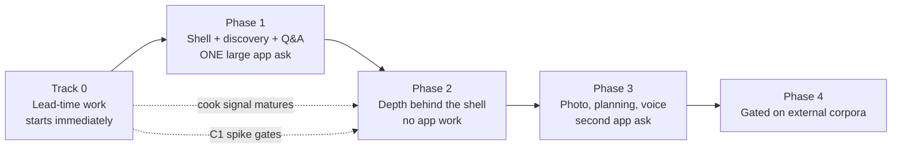

# Build Plan — MyRecipes Assistant

**Status:** Draft for engineering review
**Author:** Andrew Alburn
**Audience:** Dale (FS&D engineering), with follow-on conversations for Smart Labs, Data Science, and MLEP
**Purpose:** Propose a sequence for building the assistant — backend and app together — at a level of detail we can attach people to
**Last updated:** September 15, 2026

**Inputs:** `Assistant Backend Capability Map.md` · `poc/PRD - Agentic Recipe Assistant.md` · `poc/PRD - Dinner Decision Engine.md` · `PRD - Assistant Semantic Query Planner.md` · `Dinner Tonight - Data Science Problem Statement.md` · `poc/PRD - User Recommendation Preferences.md` · `poc/PRD - Catch a Vibe.md` · `poc/PRD - Photo-Based Recipe Discovery.md`

---

## 1. What this is, and what I need from you

The Backend Capability Map decomposed the assistant into five foundations and six capabilities and proposed a sequence. This document adds the app-side work, re-sequences around the constraints we actually have, and breaks each phase into workstreams concrete enough to size.

I've taken positions rather than leaving things open — you'll get further arguing with a real proposal. Where I'm guessing, I've said so.

**What I need:**

1. Corrected sizing, especially the app and integration columns. Those are my weakest numbers.
2. A verdict on §3. If the organizing idea doesn't hold technically, the whole sequence changes.
3. A read on how much of Phase 1 we could do ourselves, and how fast.
4. Pushback on §7 — those decisions get expensive to revisit.

---

## 2. What's changed since the Capability Map

The map was written as a backend document against looser assumptions. Four things now shape the plan more than its dependency graph does.

- **App first.** The first release lands in the MyRecipes app — React Native, and the app's existing backend surface. Web may follow.
- **App capacity is negotiated, not allocated.** Smart Labs builds most of the app frontend today and we lobby for roadmap slots each planning cycle. Ownership is moving to People Inc over time, but across this plan's horizon every app ask is a negotiation. Plans that need repeated asks will slip in ways we can't manage.
- **Our frontend developer needs to ramp on React Native and on this app.** Worth funding as a line item, and worth starting earlier than the project strictly requires — it's the thing that shrinks the constraint above. Every month of ramp is more app work we can schedule ourselves.
- **Nothing has moved since August 21.** No C1 spike, no Content API access, no Data Science point of view, no cook-signal capture, no infrastructure decision. All of the capability map's §11 is still ahead of us, which means the order is still ours to change.

One useful starting condition: the app already has accounts, saves, collections, and search in production. The write path has something real to extend and library retrieval has something real to query.

---

## 3. The organizing idea

The capability map framed the choice as a bet: grounded answers first, or discovery first. The app-capacity constraint replaces that with a better question.

The expensive thing isn't any capability. It's the **assistant shell in the app** — entry point, sheet, session, input, loading states, result rendering. So optimize for the fewest separate app asks, not for the most strategic capability.

> **The app renders result formats the server declares. It does not know what capabilities exist.**

The shell learns a fixed component vocabulary — carousel, ranked list, labeled answer, plan view, follow-up chips — and the server response picks one and fills it. A new capability becomes a server deploy instead of a roadmap negotiation. It pays off again when web arrives: a second client inherits every shipped capability for the cost of learning the same vocabulary.

### 3.1 Two conditions, both testable now

The master PRD asserts this as an FR10 acceptance criterion — "swapping a mocked tool for a real one requires no change to the orchestrator or UI." True in the POC, where the orchestrator and UI share a process and a tool interface is a function signature. In production it's something we have to engineer, not something we inherit.

**One: the Phase 1 response contract has to carry Phase 2's result shapes.** A swap is only invisible when the result shape doesn't change, and it does. Grounded answers add a citation, a source link, and an honest-miss state distinct from "I don't know." Makability ranking returns ingredient-overlap evidence that a rules-based why-line has no field for. Latency profiles differ enough to affect loading treatment. All manageable — but only if those fields ship in Phase 1 unpopulated rather than get added later. That makes contract design a named Phase 1 deliverable.

**Two: server changes have to reach app users without an app release.** Phase 2's entire value is that capabilities ship as server deploys. If the layer the app talks to rides the app's release train, or there's no server-controlled feature flagging, Phase 2 isn't free no matter how good the renderer is. I believe this is mostly fine — but "mostly" is carrying too much weight for something this load-bearing.

### 3.2 A third workstream, easy to miss

Two columns — backend we own, app work we negotiate — leaves out everything between our services and the app:

- Exposing each capability through whatever layer the app actually talks to
- Auth and identity, resolving the app's user to the user our profile service knows
- Saves and collections, owned by another team — for reads as well as the write path
- Attribution events into the app's analytics stack
- Client-version negotiation for users on older builds

Small per item, never zero, and the most cross-team of the three — the classic profile of underestimated work. It gets its own column in §6. I can't see this layer clearly, and correcting my picture of it is one of the most useful things you can do to this document.

---

## 4. How I prioritized

Three questions, applied to every item:

- **Does it need an app negotiation?** If yes, it batches with other app work around a cycle boundary. If no, we start it whenever we have people.
- **Does it depend on data we haven't started collecting?** We can't retroactively learn what someone cooked in September. Anything with a collection lead time starts now or silently pushes everything behind it.
- **Can it swap in behind an interface that already exists?** Improving something already shipped is far cheaper than introducing something new, and it ships continuously rather than in releases.

That sort produces a different order than the capability map's dependency-depth sort — and a sequence that survives a bad C1 spike result, which the original didn't.

---

## 5. The sequence

### Track 0 — Starts now, independent of everything else

Five items that cost us unrecoverable calendar if they wait. None is a release. All should start before Phase 1.

**Cook-signal capture.** An "I made this" action. Smallest item in the plan, longest lead time, because its value is accumulated history. "Most-cooked" and "saved but never made" are unanswerable without it, and it's the eventual ground truth for whether dinner recommendations work at all. It needs a small app change, so **bundle the button into the Phase 1 ask.** We shouldn't spend a roadmap negotiation on a button.

**Server-side explicit preferences.** Storage and a write API for diet, dislikes, cuisines, cooking style, and pantry staples, per the User Recommendation Preferences PRD. Small, entirely ours, and it unblocks the hard-constraint contract everything downstream depends on. Like the cook signal, its value compounds with time.

**Content API access, corpus audit, and the C1 spike.** One question type, one content area, real measurement: latency, honest-miss rate, and whether Serious Eats technique content ranks well through an API with no domain filter and no relevance score. The measurement scaffolding *is* the start of the evaluation harness, not a separate project. Worth adding a small non-food control set — a few days' cost, and it turns "this works for recipes" into evidence the pattern isn't food-specific, which matters for how this gets funded.

**Image-handling privacy and legal review.** A calendar dependency rather than an effort one, so it starts at the beginning of a phase rather than the end. Only relevant if photo understanding stays in scope, which I think it should.

**React Native and app ramp for our frontend developer.** Worth funding on its own merits: People Inc is taking over building the app regardless, so fluency is a down payment either way. It also relaxes the constraint this plan is organized around — the more app work we can do ourselves, the less depends on winning a slot. Better named and funded than discovered as a velocity problem in Phase 1.

### Phase 1 — The assistant lands in the app

The one large app negotiation. Everything we can imagine needing from the app for the next several quarters goes in this ask.

**Backend (ours):**

- **F1 — Intent and orchestration.** Versioned intent contract first, since everything conforms to it. Then the tool registry, surface-context handling, the cached plan library for the Semantic Query Planner's nine common intents, LLM planning as fallback, and the inspectability path. Built to the full planner spec, not a thin router — §7 has why I moved off the map's "F1-lite."
- **F3 — Session and context store.** Active constraints, prior turns, current result set, exclusion ledger. Constraint merge semantics are the subtle part; design them rather than letting behavior emerge.
- **Retrieval binding.** Orchestrator to the app's production search, replacing the POC's MCP path.
- **Discovery.** Semantic Query Planner plus Dinner Decision Engine on retrieval, hard gates, explicit preferences, and rules-based ranking — without the inferred taste profile, which isn't ready. Dinner-eligibility gating and diversity rules are the substance.
- **Recipe Q&A.** Labeled and ungrounded, as the POC does today, behind the interface grounded answers will later occupy.
- **F5 — Evaluation harness, first pass.** Golden query sets, constraint-violation checks, shared trace view. The planner's evaluation queries and the dinner engine's regression set are ready-made content.

**App (Smart Labs leading, our frontend developer paired in):**

- Assistant entry point across Home, Recipe, and Saves — consistent and genuinely ignorable.
- Bottom sheet that overlays rather than replaces, returning to prior state on dismiss.
- **The generic result renderer** — carousel, ranked list, labeled answer, follow-up chips, loading skeletons. This is what makes Phase 2 free.
- Surface-context capture and session handshake.
- The cook-signal button.

Pairing our developer in does double duty: fastest path to app fluency, and the shell is the right thing to be fluent in since everything later extends it.

**Integration (us, with whoever owns the layer between the app and our services):**

- **The versioned response contract**, carrying Phase 2's result shapes. Condition one from §3.1, and the highest-leverage design task in the phase.
- Endpoint exposure through whatever the app talks to.
- Auth and identity resolution.
- Server-controlled feature flagging — this is what makes Phase 2 deployable.
- Client-version negotiation for older builds.
- Analytics and attribution plumbing.
- Read access to saves and collections.

Not the largest workstream, but it touches the most teams, and cross-team work is where schedules go quietly wrong.

**Done means:** a user opens the assistant from three surfaces, runs a core flow entirely from tappable suggestions, gets two or three real constraint-respecting dinners with honest why-lines, asks a labeled question about the recipe in view, refines without restating constraints, and never sees a silent constraint violation.

**Unlocks:** all of Phase 2, without another app release.

### Phase 2 — Depth behind the shell

The payoff phase, conditional on §3.1 holding. Everything here improves something already shipped and needs little or no app work — provided the Phase 1 contract anticipated these result shapes and we can deploy without an app release. If either condition failed, parts of this phase acquire an app column and batch into Phase 3 instead.

- **C1 — Grounded answers**, behind the Q&A interface. Query formulation, food-relevance filtering, synthesis with citation, confidence routing, caching by normalized question. Gated on the Track 0 spike; if it says no, we skip this and nothing else moves.
- **F2 — Composed profile read API.** One call returning explicit, inferred, and behavioral signals, with hard constraints enforced in one place rather than per capability. Explicit preferences have been collecting since Track 0 and the Flavor Profile is available to compose in.
- **C3 — Saved-library retrieval.** A queryable view over saves joined to metadata, plus the semantic layer turning "quickest to make" into a sort and "the chicken ones" into a filter. The cook signal has been accumulating since Track 0, which is what makes "most-cooked" answerable here rather than never.
- **C2 — Dinner recommendation and makability.** Data Science ranking and makability behind the recommendation interface, with our eligibility gating, evidence-to-copy, and diversity on top. Discovery stops being rules-based — and because the interface didn't change, it's a server deploy.
- **F5 — Evaluation harness, second pass.** Groundedness and citation accuracy, latency percentiles, online metric wiring.

**Outside our control:** MLEP's Content API and the Data Science point of view we've asked for. Chase both during Phase 1, not at the start of Phase 2.

### Phase 3 — The second negotiation

New app surfaces, batched into one ask rather than trickled.

- **C5 — Photo understanding.** Pantry mode, dish mode, and Catch a Vibe — already specified and built in the POC, and the most demo-able thing we have. Self-contained: needs retrieval, benefits from the profile, depends on neither the cook signal nor grounded answers. Camera and chip-editing UI is what puts it here rather than earlier.
- **C4 — Meal planning and smart collections**, with **F4 — the write path**. Set generation with diversity and set-level coherence, refinement carrying full plan context, plans persisted as typed collections. Attribution goes into the write path from the start — retrofitting it is how we end up unable to prove what we said we'd prove.
- **C6a — Speech-to-text input.** Smallest item in the plan, best effort-to-value ratio on the list. Mostly client work plus token handling.
- **C6b — Grounded answers in voice.** Gated on C1, and fundamentally a latency problem rather than a new capability. A gate we pass, not a date we commit to.

### Phase 4 — Gated on things we don't control

- **C1b — Community content grounding.** C1's pattern pointed at reviews and comments. Gated on an ingestion pipeline that doesn't exist and a permissions and attribution posture; the Content API doesn't cover UGC.
- **Cross-session memory.** Promoting repeated session constraints into stored preferences, with the consent question attached.
- **Multi-recipe cooking guidance.** Still an internal experiment. Worth running it during an earlier phase so we know whether there's anything here.

---

## 6. Sizing

Backend sizes carry over from the Capability Map. App and integration sizes are new and are the weakest numbers here — a starting point for you and Smart Labs to correct, not an estimate. Integration is the §3.2 connective tissue: the layer between our services and the app, plus anything owned by another team.

| Item | Phase | Backend | App | Integration | Likely owner |
|---|---|---|---|---|---|
| Cook-signal capture | Track 0 | S | S | S | Us + Smart Labs |
| Explicit preferences (server-side) | Track 0 | M | — | — | Us |
| Content API access + corpus audit + C1 spike | Track 0 | M | — | — | Us + MLEP |
| Image privacy/legal review | Track 0 | — | — | — | Legal, we drive |
| React Native / app ramp (our FE developer) | Track 0 | — | M | — | Us, paired with Smart Labs |
| **Versioned response contract design** | 1 | S | — | M | Us + app backend owner |
| F1 — Intent & orchestration | 1 | L | — | — | Us |
| F3 — Session & context store | 1 | M | S | — | Us |
| Retrieval binding to production search | 1 | M | — | S | Us |
| Discovery (planner + dinner engine, rules-ranked) | 1 | L | — | — | Us |
| Recipe Q&A (labeled, ungrounded) | 1 | S | — | — | Us |
| F5 — Evaluation harness, first pass | 1 | M | — | — | Us |
| Assistant shell + generic result renderer | 1 | — | **L** | — | Smart Labs + us |
| Endpoint exposure, auth, flagging, version negotiation | 1 | — | S | **M** | Us + app backend owner |
| C1 — Grounded answers | 2 | XL | — | — | Us + MLEP |
| F2 — Composed profile service | 2 | L | S | S | Us + Data Science |
| C3 — Saved-library retrieval | 2 | M | — | S | Us + saves owner |
| C2 — Dinner recommendation & makability | 2 | L | — | — | Data Science + us |
| F5 — Evaluation harness, second pass | 2 | M | — | — | Us |
| C5 — Photo understanding (incl. Catch a Vibe) | 3 | M | M | S | Us + Smart Labs |
| F4 — Write path | 3 | M | S | **M** | Us + collections owner |
| C4 — Meal planning & smart collections | 3 | L (M if shared with C2) | M | S | Us |
| C6a — Speech-to-text input | 3 | S | S | S | Us + Smart Labs |
| C6b — Grounded voice | 3 | L | M | M | Us |
| C1b — Community grounding | 4 | L | — | — | Us + corpus owner |
| Cross-session memory | 4 | M | — | — | Us |

Three things worth noticing. Phase 2's app and integration columns are nearly empty — the whole point of the plan, and a consequence of §3.1 holding rather than a given. The largest app item sits in Phase 1, which is why that negotiation deserves our best effort. And the integration column is small per row but never zero: no single item is worth escalating, and collectively it's a person.

---

## 7. Positions on the open arguments

The Capability Map named five arguments it expected us to have. Where I've landed:

**Own infrastructure or shared platform?** Build the orchestrator ourselves; consume MLEP's Content API as a service. The intent contract is where our differentiation lives, and handing it to shared platform means negotiating every change to it indefinitely. But I can't see what shared infrastructure exists or how well it fits, and this is expensive to revisit — so I want your read before we commit. The narrower version I'm confident about: don't rebuild retrieval, don't rebuild the corpus.

**Is a recipe-page-only first release right?** No, which moves off the capability map's own recommendation. The containment argument is real, but it predates the app-first, negotiated-capacity constraint. A smaller ask is still an ask, and it buys the capability we can least attribute to saves per session — then we'd need a second, larger negotiation for discovery off the back of a phase we struggled to justify. We're better positioned to win a large slot now, with a working prototype and a live strategic argument, than we will be a phase from now. Make the bigger ask, once.

**What does the first release get measured on?** Largely resolved by the sequence — discovery ladders to saves per session in a way post-decision Q&A never will. What still needs pre-negotiating with leadership is assistant-attributed saves as the leading indicator, with attribution designed into the write path from the start rather than retrofitted. The Track 0 cook signal is the eventual ground truth.

**One set-generation service, or two?** One, taking cardinality and diversity policy as inputs. Two implementations means two places for constraint enforcement to drift. A second reason specific to us: we're heading toward multiple clients, built by multiple sets of hands during an ownership transition. Single-place server-side enforcement is the only way the trust promise holds uniformly — and if part of it lives in client code, it'll quietly stop being a guarantee on one client, and we won't find out from an exception.

**What if the spike says no?** Much less than under the original sequence. It costs us the C1 branch — grounded answers, community grounding, grounded voice — and nothing else. Phase 1 has shipped, discovery continues, Q&A stays labeled and model-backed. Under the capability map's ordering a "no" would have invalidated the entire first phase. That's an argument for the reframe, not a contingency to plan around.

---

## 8. Risks

- **The generic renderer might not hold.** If server-declared rendering isn't practical in the app, Phase 2 stops being free. First thing to validate, before we finalize the Phase 1 ask.
- **Server changes might not reach users without an app release.** Highest-consequence unknown in the document. If the app's backing layer rides the release train, or there's no server-controlled flagging, Phase 2 loses its defining property.
- **Integration is the classic underestimate.** Small per item, spread across teams, invisible until something blocks on a team that didn't know it was on the critical path. Auth/identity and the collections boundary go earliest so surprises surface early.
- **We're asking for a large app slot on our first try.** If it doesn't land, the fallback is a smaller shell with fewer result formats, which costs us the Phase 2 advantage. Worth deciding the minimum viable version now so we negotiate from a position. A ramped frontend developer is a real hedge here.
- **Two Phase 2 capabilities depend on teams that owe us answers.** Data Science on makability, MLEP on Content API access. Not blockers today; both become blockers the moment Phase 1 ends.
- **The React Native ramp could be bigger than M.** That's a guess from outside. If it's materially larger it compresses Phase 1 and delays the point where app work becomes ours to schedule.
- **Course and ingredient metadata coverage.** The dinner-eligibility gate needs course metadata we don't fully have; makability needs ingredient normalization tied to the ontology work. The gate is load-bearing for Phase 1, so we need a position: gate on metadata, infer course, or both.

---

## 9. What I'd like to walk out of the session with

1. A yes or no on the two §3.1 conditions — the generic renderer, and whether server changes reach users without an app release — or agreement on how to find out fast. These gate the shape of the Phase 1 ask.
2. A map of what sits between the app and our services, who owns it, and what an endpoint costs us there. The part of the plan I can see least clearly.
3. Corrected sizing on the shell, the integration column, and the React Native ramp.
4. A view on how much of Phase 1 we could build ourselves if the app negotiation goes badly, and how soon that's a real option.
5. Your position on infrastructure — own it or build on shared platform.
6. Agreement to start Track 0 now. Those five items don't need the rest of the plan settled, and every week we don't start them is a week we can't get back.
